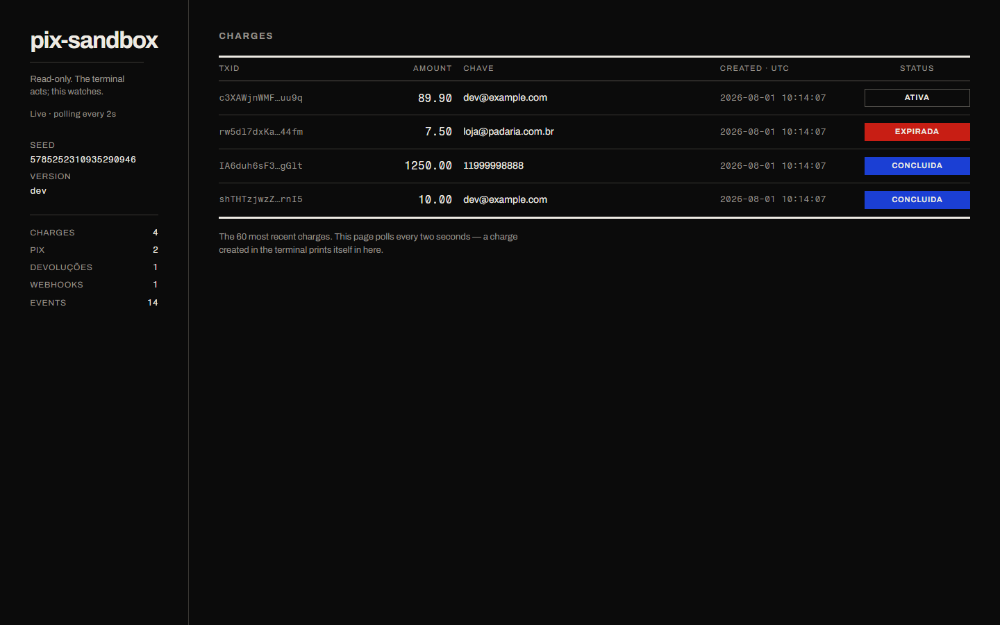
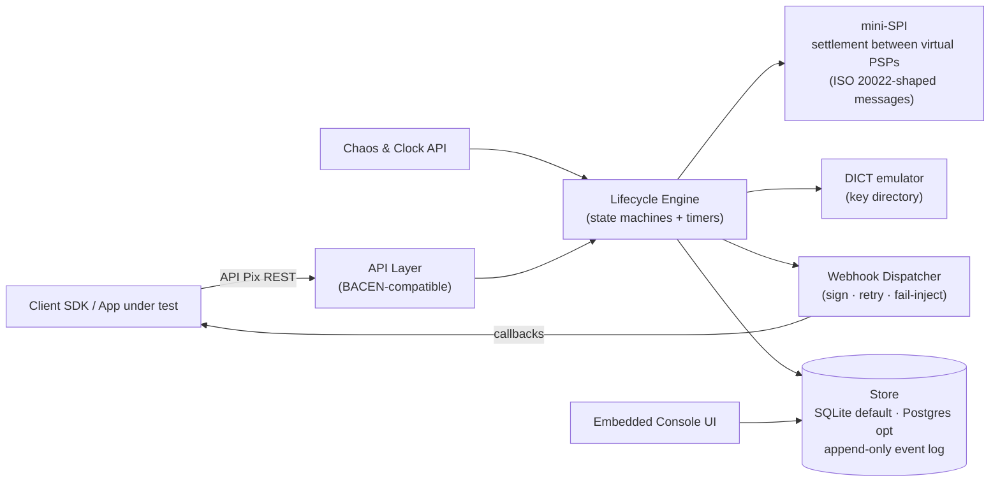

# pix-sandbox

[](https://github.com/arinellidu/pix-sandbox-pay/actions/workflows/ci.yml)
[](go.mod)
[](https://github.com/arinellidu/pix-sandbox-pay/pkgs/container/pix-sandbox-pay)
[](LICENSE)

> A drop-in Pix emulator — the full instant-payment lifecycle (charge → EMV QR → payment → refund → webhook) in a single binary. Built for teams integrating with Brazilian PSPs, and for FedNow/SEPA teams studying the world's largest instant-payments deployment.

**Status:** v0.1.0 — the loop closes. Create a charge, pay it, refund it, watch the signed callback land, and read every transition in the embedded console. The chaos API, the virtual clock and multi-PSP settlement are next; see the [roadmap](#roadmap) and [docs/DESIGN.md](docs/DESIGN.md).

## Why this exists

Pix moved a country onto instant payments in four years, and every team that integrates with it hits the same wall: there is no realistic place to build against it. PSP sandboxes need onboarding, credentials and network access; none of them let you force a rejection, drop a webhook, or fast-forward an expiry. So integrations get tested against hand-rolled mocks that agree with whatever the developer assumed, and the assumptions surface in production — a `txid` replayed, a callback retried, a refund that exceeds what settled.

pix-sandbox is the local environment that argument deserves. It speaks BACEN's public API Pix surface, so real SDKs run against it unmodified; it is deterministic by default, so a failing CI run reproduces exactly from its printed seed; and its source of truth is an append-only event log, so the console shows you what *happened* rather than what the current row says. That last part is why it doubles as a teaching artifact: the sequence `cob.created → pix.received → cob.settled → webhook.delivered → pix.devolucao.requested → pix.devolucao.settled` is the Pix lifecycle written out in full, and a FedNow or SEPA Instant engineer can read it without ever touching a Brazilian bank.

## Run it

```bash
docker run -p 8080:8080 ghcr.io/arinellidu/pix-sandbox-pay
```

Or grab a binary from the [latest release](https://github.com/arinellidu/pix-sandbox-pay/releases/latest) — static and CGO-free, so there is nothing to install alongside it.

Or straight from source (Go 1.26, no CGO, no external services):

```bash
go run ./cmd/pix-sandbox
```

`make run` (Linux/macOS) and `.\run.ps1` (Windows) are wrappers over exactly that.

## The 60-second loop

```bash
curl :8080/health
# {"status":"ok"}

# Where the callbacks should go. Any local echo server will do.
curl -X PUT :8080/webhook/dev@example.com -H 'Content-Type: application/json' \
     -d '{"webhookUrl":"http://127.0.0.1:9099/pix"}'

curl -X POST :8080/cob -H 'Content-Type: application/json' \
     -d '{"valor":{"original":"10.00"},"chave":"dev@example.com"}'
# 201 → the charge, with txid, status ATIVA and a payable pixCopiaECola

curl -X POST :8080/sandbox/pay -H 'Content-Type: application/json' \
     -d '{"txid":"<txid>","infoPagador":"Coffee"}'
# 201 → the pix, with an e2eId — and a signed POST lands on your endpoint:
#       {"pix":[{"endToEndId":"E12345678...","txid":"...","valor":"10.00", ...}]}

curl -X PUT :8080/pix/<e2eId>/devolucao/dev1 -H 'Content-Type: application/json' \
     -d '{"valor":"10.00"}'
# 201 → the devolução, DEVOLVIDO, and a second callback carrying it
```

Then open **<http://localhost:8080/console>**: the charge, its status, and every transition it went through.

## Console

An embedded, read-only UI at `/console` — the terminal acts, the console watches.



- **Charges** as a ledger: txid, amount, key, creation instant and status as a flat colour field. It polls every two seconds, so a charge created in the terminal prints itself into the page.
- **One charge** as its [recorded timeline](docs/console-timeline.png): every event in the append-only log, stepping in from the margin as the story moves from the charge to the payment it settled into, and again to the callback that announced it — with each payload rendered in the domain's own language (cents, not decimal strings).

It ships inside the binary: fonts, stylesheet and htmx are all embedded, and the page makes no external request of any kind. Its visual system is documented in [DESIGN.md](DESIGN.md).

## Endpoints

| Method & path | Purpose |
|---|---|
| `GET /health` | Liveness; also pings the store |
| `POST /oauth/token` | Mock client-credentials grant — accepts a form or JSON body, and no body at all |
| `POST /cob` | Create an immediate charge; mints a txid when the body omits one |
| `PUT /cob/{txid}` | Create with a txid you choose |
| `GET /cob/{txid}` | Read the charge; settles a pending expiry first |
| `GET /cob/{txid}/qrcode` | `{"qrcode": "<EMV payload>", "imagemQrcode": null}` |
| `GET /pix/{e2eId}` | Read a received payment and its refunds |
| `PUT /pix/{e2eId}/devolucao/{id}` | Refund a payment; idempotent on the id you choose |
| `PUT /webhook/{chave}` · `GET /webhook/{chave}` | Register and inspect the callback endpoint for a key |
| **Sandbox-only:** `POST /sandbox/pay` | Simulate a payer settling a charge |
| `GET /console` | The embedded read-only UI |

The rest of the [API Pix surface](docs/DESIGN.md#6-api-surface-v1) arrives phase by phase.

Errors are RFC 7807 documents (`application/problem+json`) shaped like BACEN's, listing every violation at once:

```json
{
  "type": "https://pix.bcb.gov.br/api/v2/error/CobOperacaoInvalida",
  "title": "Cobrança inválida.", "status": 400,
  "violacoes": [{"razao": "amount \"10\" must have two decimal places", "propriedade": "valor.original"}]
}
```

## Architecture



Shipped today: the API layer, the store, the webhook dispatcher and the console. The chaos and clock APIs, the mini-SPI and DICT arrive with the phases below.

## How it behaves

- **Idempotent on txid** (INV-2). Replaying `POST /cob` or `PUT /cob/{txid}` returns the stored charge untouched, with **200** instead of 201 so a replay is visible on the wire.
- **Identifiers are unique by construction.** An `e2eId` is `E` + ISPB + a minute-precision timestamp + six seeded characters + a base-36 sequence drawn inside the transaction that stores the row, so two minted in the same minute cannot collide however the random half falls. `rtrId` is the same shape with a `D`.
- **A charge settles once.** Paying it again is a `409` naming the payment that already exists — and the `payments` table holds the txid unique, so the database refuses a double settlement too.
- **Refunds are bounded by what settled** (INV-4), in the handler and again as a `CHECK` constraint. Only full refunds land in this phase.
- **Expiry is a recorded transition, not an inference.** Reading a charge past its window moves it to `EXPIRADA` and appends `cob.expired` to the log (INV-3). `EXPIRADA` is the sandbox's own state: BACEN leaves expiry for the client to derive from `calendario`, while this design models it explicitly.
- **Callbacks are signed, retried and logged.** Body is `{"pix":[...]}`, `X-Signature` carries the hex HMAC-SHA256 of the exact bytes sent, and a failure is retried after 1s, 5s and 25s. Delivery is asynchronous — the API response never waits on the payee's endpoint — and both outcomes reach the event log on that payment's aggregate. A `4xx` other than `429` is not retried: the receiver has said the request itself is wrong.
- **The BR Code is self-contained**: the Pix key sits in field 26-01 and the txid in 62-05, so a payload resolves without fetching a location document. **CRC16-CCITT-FALSE** closes field 63, pinned in tests against the canonical `123456789` → `0x29B1` check value and against the example in BACEN's BR Code manual.
- Money is `int64` cents everywhere inside; the `"10.00"` string exists only at the edge.
- The dispatcher posts to the URL exactly as registered. Real PSPs append `/pix` to it; the sandbox does not, because the demo loop is easier to read when the URL you registered is the URL that gets called.

## Configuration

| Flag | Env | Default | Meaning |
|---|---|---|---|
| `-addr` | `PIX_SANDBOX_ADDR` | `:8080` | Listen address |
| `-db` | `PIX_SANDBOX_DB` | `./data/sandbox.db` | SQLite file; created at boot with its parent directory |
| `-seed` | `PIX_SANDBOX_SEED` | fixed | Seed for the single random source |
| `-base-url` | `PIX_SANDBOX_BASE_URL` | `localhost:8080` | Scheme-less host used to build `loc.location` |
| `-merchant-name` | `PIX_SANDBOX_MERCHANT_NAME` | `PIX SANDBOX` | BR Code field 59 |
| `-merchant-city` | `PIX_SANDBOX_MERCHANT_CITY` | `SAO PAULO` | BR Code field 60 |
| — | `WEBHOOK_SECRET` | `pix-sandbox` | Key the `X-Signature` HMAC is computed with |

`WEBHOOK_SECRET` has no flag on purpose: a secret does not belong on a command line, where every process on the box can read it. Its default is a published constant so the loop verifies out of the box — override it when the receiver under test checks signatures against its own.

The sandbox is **deterministic by default**: every generated value comes from one seeded source, and the seed is printed at boot — rerun with the same seed to reproduce a run exactly.

## Roadmap

| Phase | Scope |
|---|---|
| **P0** — shipped | `cob` + dynamic EMV payload + `/sandbox/pay` + refunds + signed webhooks + the embedded console |
| **P1** | Virtual clock (fast-forward expiries and settlement windows), static QR, partial refunds, INV-1..4 as property tests |
| **P2** | Chaos API: forced rejection codes, injected latency, dropped and failing webhooks, MED disputes |
| **P3** | Multi-PSP settlement over a mini-SPI, ISO 20022-shaped internals, a Temporal adapter, fraud scenarios — alongside "what FedNow teams can learn from Pix" |

## Development

Plain Go commands are the source of truth; the task runners only wrap them.

```bash
go test ./...                                          # test
go tool templ generate                                 # rebuild the console templates
go build -trimpath -o bin/pix-sandbox ./cmd/pix-sandbox # build
go vet ./...                                           # vet
```

| Task | Linux/macOS | Windows |
|---|---|---|
| Run on :8080 | `make run` | `.\run.ps1` |
| Test | `make test` | `.\make.ps1 test` |
| Test under `-race` | `make test-race` | `.\make.ps1 test-race` |
| Rebuild console templates | `make generate` | `.\make.ps1 generate` |
| Build static binary | `make build` | `.\build.ps1` |
| Lint (fmt + vet) | `make lint` | `.\make.ps1 lint` |
| Build image | `make docker-build` | `.\make.ps1 docker-build` |
| All targets | `make help` | `.\make.ps1` |

The console's generated `*_templ.go` files are committed, so building the image needs no code generator; CI regenerates them and fails if the committed copy has drifted. `-race` needs a C toolchain — CI runs it on every push, which is where it belongs if your machine has no gcc.

Layout: `cmd/pix-sandbox` (entrypoint) · `internal/api` (HTTP) · `internal/core` (domain, no I/O) · `internal/emv` (BR Code TLV + CRC) · `internal/store` (append-only event log + projections) · `internal/webhook` (signed delivery with retries) · `web/console` (embedded UI) · `internal/rng` (seeded source).

The `events` table is append-only — SQLite triggers reject `UPDATE` and `DELETE` — because the log is the source of truth and projections are derived from it (INV-3). A state change and its event share one transaction, so neither can exist without the other.

Schema changes are numbered files under `internal/store/migrations/`, applied on boot and tracked in SQLite's `user_version`. A database from a newer binary is refused rather than downgraded.

### Recording the demo GIF

The README's loop is meant to be watched. [vhs](https://github.com/charmbracelet/vhs) records it reproducibly from a script, which beats a screen capture that has to be redone whenever a response changes:

```bash
go install github.com/charmbracelet/vhs@latest   # needs ttyd and ffmpeg on PATH
vhs docs/demo.tape                               # writes docs/demo.gif
```

Keep the tape honest: start a real binary with a fresh `-db`, run the same curls as above, and end on the console. A recording that fakes output is a recording that will disagree with the software.

## License

[Apache-2.0](LICENSE). This is an adoption tool; the licence should not be the reason someone cannot use it.

First consumer: [arinelli-pay](https://github.com/arinelliquebec/arinelli-pay), a multi-rail billing SaaS that uses this emulator as its local Pix provider.
