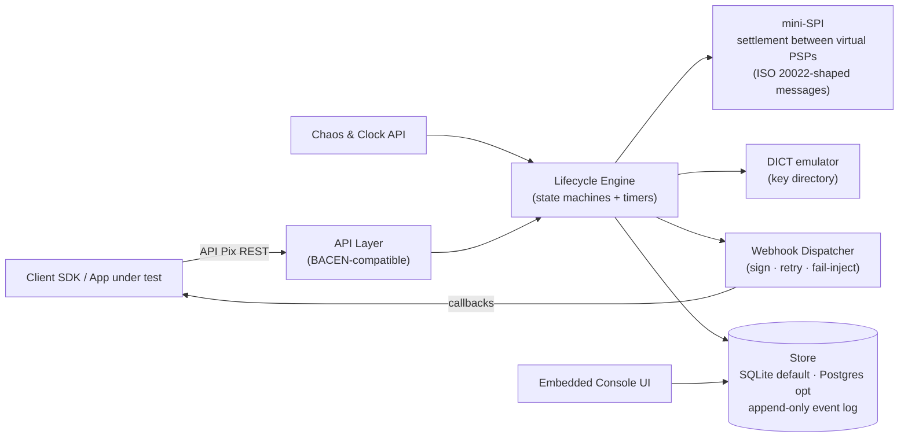
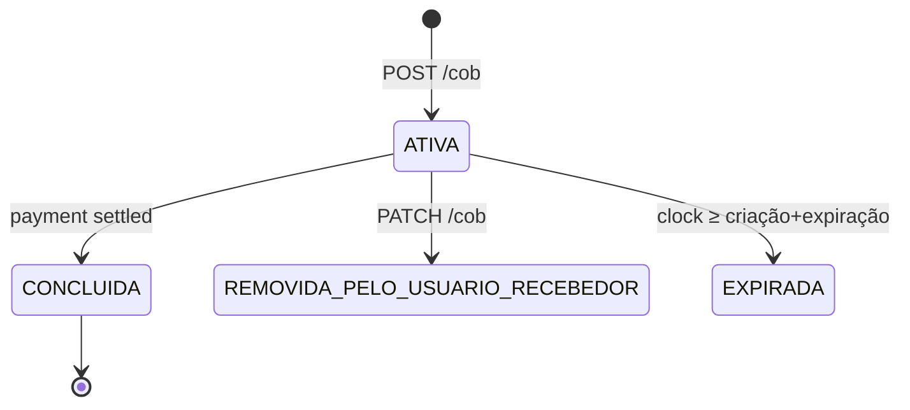

# pix-sandbox — Design Document

> **Status:** Draft v0.1 · 2026-07-31
> **Owner:** Patrick Arinelli
> **One-liner:** A drop-in Pix emulator — the full instant-payment lifecycle (charge → QR → settlement → refund → webhook) in a single binary, for engineering teams who need to build against Pix without a bank.

---

## 1. Problem & Audience

Teams integrating with Brazilian PSPs — and teams worldwide building instant payments (FedNow, SEPA Instant) who want to study the world's largest deployment — have no realistic local environment. Real PSP sandboxes require onboarding, credentials, and network access; none offer failure injection or time control.

**Personas:**
- *Integrator* — dev at a company connecting to a Brazilian PSP; wants their SDK to "just work" locally and in CI.
- *Learner* — engineer on a FedNow/SEPA team studying how Pix models charges, settlement, and refunds.
- *Tester* — QA/platform engineer who needs deterministic failure scenarios (timeouts, rejections, webhook loss) in CI.

## 2. Goals / Non-Goals

**Goals**
- API-compatible with BACEN's public **API Pix** surface (cob, pix, devolução, webhook) so real SDKs work unmodified.
- Full lifecycle simulation: immediate charge (`cob`), dynamic & static EMV BR Code, payment, settlement between virtual PSPs, refund (`devolução`), expiration.
- **Deterministic by default** (seeded), **chaos on demand** (injectable failures).
- **Virtual clock** ("test clocks") to fast-forward expirations and settlement windows.
- Single static binary, zero-config start, embedded console UI.
- Internal messages shaped as **ISO 20022** (pacs.008 / pacs.002 analogues) — the emulator doubles as a teaching tool.

**Non-Goals**
- Real money, real DICT, real SPI connectivity, or certification-grade compliance.
- Being a PSP. This is a *simulator of the ecosystem*, not a participant.
- Full `cobv` (due-date charges), batch (`lotecobv`), and Pix Automático in v1 — phased later.

## 3. High-Level Architecture



**Component responsibilities**

| Component | Responsibility |
|---|---|
| `internal/api` | BACEN API Pix handlers, mock OAuth2 token endpoint, request validation, **txid idempotency** |
| `internal/core` | Domain model: Charge, Payment, Refund, PixKey, Account — pure, no I/O |
| `internal/engine` | State machines + timer scheduling over the virtual clock; the only writer of events |
| `internal/spi` | Settlement simulator: debits/credits virtual PSP accounts via pacs.008-shaped messages, answers with pacs.002-shaped status |
| `internal/dict` | Key → account resolution (email, phone, CPF/CNPJ, EVP) |
| `internal/webhook` | Delivery with HMAC signature, exponential retry, per-endpoint failure injection |
| `internal/chaos` | Scenario API: force rejection codes, latency, webhook drops, MED dispute |
| `internal/clock` | Virtual time: freeze, advance, per-tenant test clocks |
| `internal/store` | Append-only event log + current-state projections; SQLite embedded, Postgres optional |
| `web/console` | Embedded UI (templ/htmx): charges, payments, event timeline, chaos controls |

## 4. Domain Model & State Machines

**Charge (cob)**



**Payment (pix)**

```
INITIATED → SPI_SUBMITTED → SETTLED            (happy path, e2eId assigned)
INITIATED → SPI_SUBMITTED → REJECTED(code)     (chaos or rule: invalid key, limit, ...)
SETTLED   → REFUND_PENDING → REFUNDED          (full/partial devolução, MED flag optional)
```

**Rules encoded as invariants (property-tested):**
- **INV-1 Conservation:** Σ balances across all virtual PSP accounts is constant across any settlement.
- **INV-2 Uniqueness:** `e2eId` and `txid` are unique; replayed `POST /cob` with same txid returns the original charge (idempotency).
- **INV-3 No skipped states:** every transition appended to the event log matches the state machine; projections rebuilt from the log always agree.
- **INV-4 Refund bound:** Σ refunds per payment ≤ settled amount.

## 5. Key Design Decisions (ADR seeds)

1. **BACEN API compatibility over invented API** — adoption path: real SDKs run unmodified. Cost: we track a spec we don't own. (→ ADR-001)
2. **Single binary + SQLite default** — `docker run` (or one `go install`) to first success in under a minute; Postgres behind a flag for team servers. (→ ADR-002)
3. **Append-only event log as source of truth** — projections derived; console timeline, replay, and INV-3 come for free; mirrors real payments auditability. (→ ADR-003)
4. **Virtual clock as a first-class API** — Stripe test-clocks model; without it, expiration/settlement tests need real waiting. (→ ADR-004)
5. **WorkflowEngine as an interface** — default: in-process deterministic scheduler (zero deps). Optional adapter: **Temporal**, demonstrating durable-execution semantics for long-lived lifecycles. (→ ADR-005)
6. **ISO 20022-shaped internals** — pacs.008/002 analogue structs between PSPs and mini-SPI; the emulator teaches the global language while speaking the Brazilian dialect. (→ ADR-006)
7. **Deterministic core, chaos at the edges** — all randomness seeded through one source; failure only via the Chaos API. Reproducible CI runs; seeds printed on start. (→ ADR-007)

## 6. API Surface (v1)

| Method & Path | Purpose |
|---|---|
| `POST /oauth/token` | Mock client-credentials token |
| `POST /cob` · `PUT /cob/{txid}` | Create immediate charge (idempotent on txid) |
| `GET /cob/{txid}` | Charge status |
| `GET /cob/{txid}/qrcode` | EMV BR Code payload (dynamic) |
| `GET /pix/{e2eId}` | Received payment |
| `PUT /pix/{e2eId}/devolucao/{id}` | Request refund |
| `PUT /webhook/{chave}` · `GET /webhook/{chave}` | Register/inspect callback |
| **Sandbox-only:** `POST /sandbox/pay` | Simulate a payer completing a charge |
| **Sandbox-only:** `POST /sandbox/clock/advance` | Advance virtual time |
| **Sandbox-only:** `POST /sandbox/chaos` | Inject scenario (rejection code, latency, webhook drop, MED) |

## 7. The 60-Second Demo Loop (defines the MVP)

```bash
docker run -p 8080:8080 arinelli/pix-sandbox
curl -X POST :8080/cob -d '{"valor":{"original":"10.00"},"chave":"dev@example.com"}'
# → returns txid + EMV BR Code payload
curl -X POST :8080/sandbox/pay -d '{"txid":"..."}'
# → your registered webhook receives the signed pix event
```

Everything in Phase 0 exists to make this loop real. Everything else waits.

## 8. Phased Plan

| Phase | Scope | Exit criterion |
|---|---|---|
| **P0** | cob + dynamic EMV payload + `/sandbox/pay` + webhook + minimal console | Demo loop runs end-to-end; README GIF recorded |
| **P1** | Refunds, expiration, virtual clock, static QR | Full lifecycle w/ time control; INV-1..4 property tests green |
| **P2** | Chaos API, real rejection codes, webhook failure modes | CI-grade failure scenarios documented |
| **P3** | Multi-PSP settlement, ISO 20022-shaped internals, Temporal adapter, fraud scenarios (mule pattern, MED timeout) | "What FedNow teams can learn from Pix" ships alongside |

## 9. Tech Notes

- **Go 1.26**, stdlib-first: `net/http` + `chi`, `templ` + htmx console, `modernc.org/sqlite` (CGO-free) default.
- Delivery: AI-assisted implementation, human-owned architecture and review — this document is the spec anchor (CLAUDE.md points here).
- License: TBD (Apache-2.0 leaning — adoption tool, maximal reach).
- Observability: OTel traces across the lifecycle; the trace of one payment is itself a teaching artifact.

## 10. Open Questions

- `cobv` (due date) in v1.1 or later?
- DICT: static config file vs. CRUD API for keys?
- Console: read-only timeline first, or chaos controls in UI from P2?
